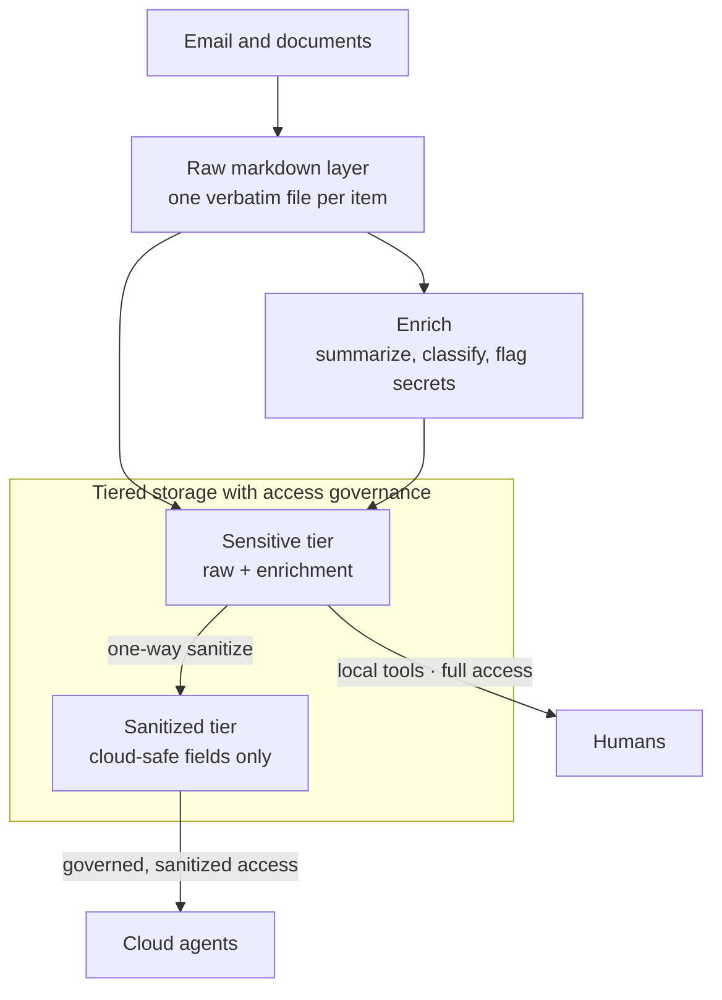

<p align="center">
  
</p>

<p align="center">Semantic search and structured query over your own content.</p>

<p align="center">
  <a href="https://github.com/ryanjdillon/corpus/actions/workflows/ci.yml"></a>
  <a href="https://ryanjdillon.github.io/corpus/"></a>
  <a href="https://ryanjdillon.github.io/corpus/"></a>
  <a href="LICENSE"></a>
</p>

corpus turns your own content into something you can search by meaning and query
by fact. It ingests items from pluggable sources, classifies each with cheap
header and rule heuristics, embeds it through an OpenAI-compatible endpoint, and
stores the vectors and metadata in Postgres/pgvector.



The raw markdown layer keeps every item verbatim. Enrichment and the tiered
stores are derived from it: a **sensitive** tier holds raw plus enrichment for
you and your local tools, and a one-way sanitize projects only cloud-safe fields
into a **sanitized** tier that governed agents may read. Access is a property of
the tier, not an afterthought.

The embedding endpoint is any OpenAI-compatible API. Run a local model and
nothing leaves your network; use a hosted provider and the pipeline is the same.

Email ships today over IMAP and Gmail. A source is anything that yields records,
so other document types fit the same model — see the [sources guide][sources].

## Two ways to query

- **Semantic search** — vector similarity with optional metadata filters.
- **Structured query** — analytical metadata queries that return every match
  (say, every message with a given label before a date) as plain SQL.

Both are served over a REST API and an MCP server.

## Quickstart

```bash
pip install -e .

export CORPUS_DATABASE_URL=postgresql://…      # pgvector
export CORPUS_OPENAI_API_BASE=https://…/v1     # embedding endpoint
export CORPUS_OPENAI_API_KEY=…

corpus ingest imap:example   # sync one source
corpus api                   # REST API   (default :8000)
corpus mcp                   # MCP server (default :9000)
```

Configuring a source takes a handful of env vars — [IMAP][imap], [Gmail][gmail].
See [Configuration][config] for the rest.

## Documentation

Full docs: **<https://ryanjdillon.github.io/corpus>**

- [Architecture][arch] — the pipeline, module by module
- [Configuration][config] — every `CORPUS_` setting
- [Sources][sources] — the fetcher protocol, IMAP, and Gmail
- [Database][db] — the pgvector store and sync state
- [Observability][obs] — OpenTelemetry traces and metrics
- [Development][dev] — tests, the pre-PR gate, and builds

## Development

```bash
nix develop      # Python, uv, just, ruff, commitlint
just setup       # create the venv, install deps
just check       # lint + coverage + architecture gate + commitlint
```

See [Development][dev] for the test tiers and release build.

## License

corpus is released under the [Mozilla Public License 2.0](LICENSE). Use it for
anything, commercial work included. If you modify corpus's own source files,
publish those changes under the same license and keep the notices — so
improvements come back to the project rather than disappearing into a private
fork.

[arch]: https://ryanjdillon.github.io/corpus/architecture.html
[config]: docs/configuration.md
[sources]: docs/fetchers/index.md
[imap]: docs/fetchers/imap.md
[gmail]: docs/fetchers/gmail.md
[db]: docs/database.md
[obs]: docs/observability.md
[dev]: docs/development.md
