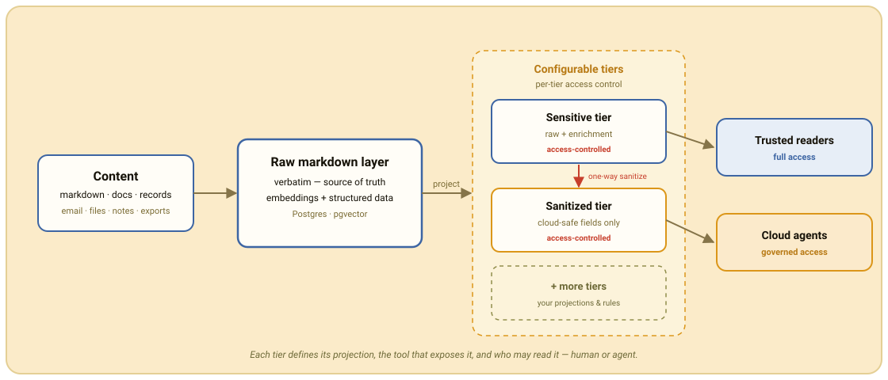

<p align="center">
  
</p>

<p align="center">Semantic search and structured query over your own content.</p>

<p align="center">
  <a href="https://github.com/ryanjdillon/corpus/actions/workflows/ci.yml"></a>
  <a href="https://ryanjdillon.github.io/corpus/"></a>
  <a href="https://ryanjdillon.github.io/corpus/"></a>
  <a href="LICENSE"></a>
</p>

corpus is a knowledge base for your own content. Point it at markdown, documents,
or structured records — corpus classifies each item, embeds it through an
OpenAI-compatible endpoint, and stores the vectors alongside structured metadata
in Postgres/pgvector. Then query it by meaning or by fact.

<p align="center">
  
</p>

Everything starts from a raw markdown layer that keeps each item verbatim. From
it, corpus derives a **configurable set of storage tiers**: each tier declares
its projection, the tool that exposes it, and an access rule naming who may read
it. A sensitive tier serves raw plus enrichment to callers you trust with the
originals; a one-way sanitize projects only cloud-safe fields into a tier a
lower-trust caller — a cloud-model agent — may query. Add as many tiers as your
trust boundaries need; access is a property of each tier, not bolted on afterward.

The embedding endpoint is any OpenAI-compatible API. Run a local model and
nothing leaves your network; use a hosted provider and the pipeline is the same.

A *source* is anything that yields records, so one pipeline covers many content
types. Email lands first, over IMAP and Gmail; files, notes, and exports fit the
same shape — see the [sources guide][sources].

## What you can ask

corpus answers three kinds of question, over a REST API and an MCP server:

- **Find by meaning** — semantic search: vector similarity with optional metadata
  filters, so the right item surfaces even when you don't recall a keyword.
- **Filter by fact** — structured query: exhaustive metadata queries that return
  *every* match (every item with a given tag, from an account, in a time window)
  as plain SQL — not a ranked sample.
- **Ask what matters** — enrichment distills each item into a priority signal you
  query directly: what needs an action, what's due or time-sensitive, what you're
  waiting on, what's happening in a domain like banking, health, or work.

Callers you trust with the raw items get the full surface — search, structured
query, whole-document fetch, and stats. A lower-trust caller sees only the
sanitized tier's priority signal, projected free of raw content: a cloud-model
assistant can plan your day from *what needs action* and *what's due soon*
without ever touching the underlying documents.

## Quickstart

```bash
pip install -e .

export CORPUS_DATABASE_URL=postgresql://…      # pgvector
export CORPUS_OPENAI_API_BASE=https://…/v1     # embedding endpoint
export CORPUS_OPENAI_API_KEY=…

corpus ingest imap:example   # sync one source
corpus api                   # REST API   (default :8000)
corpus mcp                   # MCP server (default :9000)
```

Configuring a source takes a handful of env vars — [IMAP][imap], [Gmail][gmail].
See [Configuration][config] for the rest.

## Documentation

Full docs: **<https://ryanjdillon.github.io/corpus>**

- [Architecture][arch] — the pipeline, module by module
- [Configuration][config] — every `CORPUS_` setting
- [Sources][sources] — the fetcher protocol, IMAP, and Gmail
- [Database][db] — the pgvector store and sync state
- [Observability][obs] — OpenTelemetry traces and metrics
- [Development][dev] — tests, the pre-PR gate, and builds

## Development

```bash
nix develop      # Python, uv, just, ruff, commitlint
just setup       # create the venv, install deps
just check       # lint + coverage + architecture gate + commitlint
```

See [Development][dev] for the test tiers and release build.

## License

corpus is released under the [Mozilla Public License 2.0](LICENSE). Use it for
anything, commercial work included. If you modify corpus's own source files,
publish those changes under the same license and keep the notices — so
improvements come back to the project rather than disappearing into a private
fork.

[arch]: https://ryanjdillon.github.io/corpus/architecture.html
[config]: docs/configuration.md
[sources]: docs/fetchers/index.md
[imap]: docs/fetchers/imap.md
[gmail]: docs/fetchers/gmail.md
[db]: docs/database.md
[obs]: docs/observability.md
[dev]: docs/development.md
